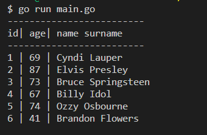

# gotestdb
Simple go program using postgreSQL

1) Prerequisite installed or access to PostgreSQL <br>
2) Prerequisite GO fully installed and working<br>
3) notes/postgresql.txt show how to create test database<br>
4) program structure<br>
&nbsp;&nbsp;&nbsp;gotestdb --> main.go<br>
&nbsp;&nbsp;&nbsp;gotestdb --> go.mod<br>
&nbsp;&nbsp;&nbsp;gotestdb --> go.sum<br>
&nbsp;&nbsp;&nbsp;gotestdb --> conf --> conf.json<br>
&nbsp;&nbsp;&nbsp;gotestdb --> conn --> getconf.go<br>
&nbsp;&nbsp;&nbsp;gotestdb --> conn --> db.go<br>
&nbsp;&nbsp;&nbsp;gotestdb --> proc --> checkerror.go
&nbsp;&nbsp;&nbsp;gotestdb --> proc --> insertdata.go
&nbsp;&nbsp;&nbsp;gotestdb --> proc --> listdata.go
&nbsp;&nbsp;&nbsp;gotestdb --> proc --> readtest.go
5) donwload mods --> go mod tidy<br>
6) run gotestdb --> go run main.go<br>
<br>

```
package main

import "testdb/proc"

func main() {

	// List available data
	proc.ListData()

	// Read data from database
	proc.ReadTest()

	// Upload data into database
	upload()

}

func upload() {
	proc.Insert("Cyndi", "Lauper", "69")
	proc.Insert("Elvis", "Presley", "87")
	proc.Insert("Bruce", "Springsteen", "73")
	proc.Insert("Billy", "Idol", "67")
	proc.Insert("Ozzy", "Osbourne", "74")
	proc.Insert("Brandon", "Flowers", "41")
}
```

Output Example<br><br>


